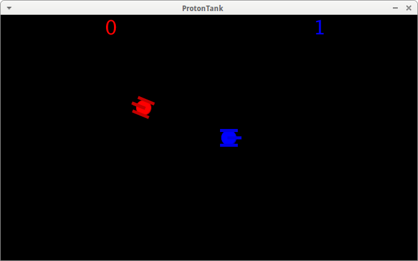

# ProtonTank

Branch||
---|---|---
`master`| | 
`develop`| | 

Tank game, written in Processing.

You can play the game at 
[the ProtonTank page of richelbilderbeek his GitHub pages](http://richelbilderbeek.github.io/ProtonTank/ProtonTank.html).

## Gameplay

ProtonTank ('Processing Team Operation Tank') is a four-player game,
in which a duo controls a tank and has to shoot the opponent tank.

Controlling a tank is done as a team, as each player controls a wheel and the cannon.
The tank will fire if both players want to fire and there is no bullet in the arena.

## Controls

Player 1 (left wheel of red tank):

 * `q`: move forward
 * `a`: shoot
 * `z`: move backward

Player 2 (right wheel of red tank):

 * `u`: move forward
 * `j`: shoot
 * `m`: move backward

Player 3 (left wheel of blue tank):

 * `r`: move forward
 * `f`: shoot
 * `v`: move backward

Player 4 (right wheel of blue tank):

 * `p`: move forward
 * `;`: shoot
 * `/`: move backward
